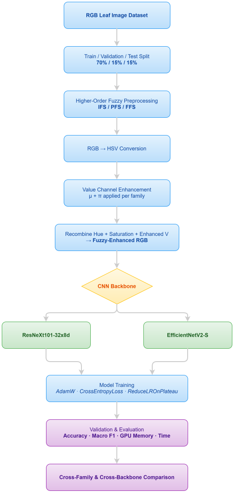

# Leaf-Disease-Detection

A compact Flask demo for plant leaf disease classification that combines higher-order fuzzy preprocessing with CNN inference.

 [Leaf Disease Detection Demo](https://baratthh-leaf-disease-detection.hf.space)


## Abstract

In real field conditions, leaf disease classification is challenged by background clutter, variable illumination, and lesions that may cover only a fraction of a leaf. This project compares intuitionistic, Pythagorean, and Fermatean fuzzy preprocessing applied to the Value channel (HSV) before CNN inference, evaluating ResNeXt101-32x8d and EfficientNetV2-S on a twelve-class plant disease task. The web demo provides interactive preprocessing, inference, and an embedded project report.

## Key Features

- Interactive web UI for uploading or selecting sample images
- Three higher-order fuzzy preprocessing methods: Intuitionistic, Pythagorean, Fermatean
- Two CNN backbones for inference: ResNeXt101 and EfficientNetV2-S
- Lazy-loading model endpoints and model-status API for lightweight deployments
- Embedded project report with figures and comparisons

## Quick Start (Windows PowerShell)

1. Create and activate a virtual environment

```powershell
python -m venv .venv
& .venv\Scripts\Activate.ps1
```

2. Install dependencies and run

```powershell
python -m pip install -r requirements.txt
python app.py
```

3. Open the app in your browser

- http://localhost:5000/
- http://localhost:5000/predict

## Project Report (PDF)

You can read the project report here: [Integrating Higher-Order Fuzzy Sets with ResNeXt101 (PDF)](static/assets/home/Integrating-Higher-Order-Fuzzy-Sets-with-ResNeXt101-for-Leaf-Disease-Detection.pdf)

## Visual Comparison

Fuzzy preprocessing comparison:


Workflow / SOP overview:



## Tech Stack

- Flask
- PyTorch (models hosted on Hugging Face)
- Jinja2 templates, simple CSS & JS for frontend
- Hugging Face Hub for model distribution (HF_REPO_ID + HF_TOKEN expected in environment)

## Live Demo

- Hugging Face Space: https://huggingface.co/spaces/Baratthh/leaf-disease-detection

## License

[MIT](LICENSE)
